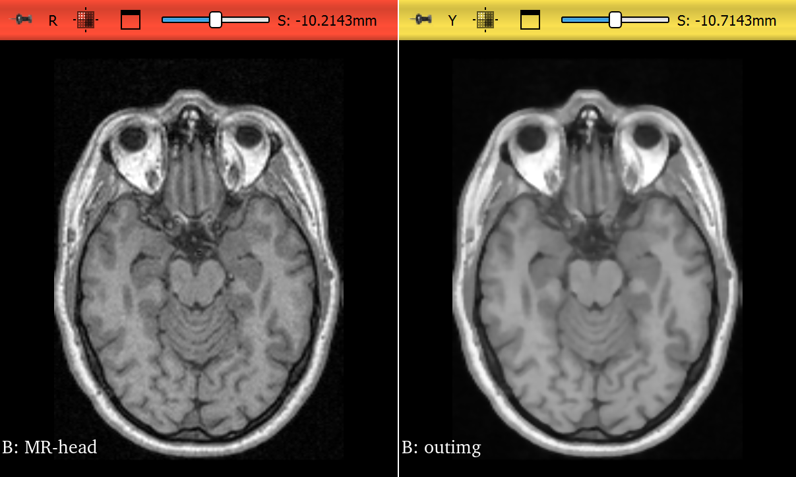

### My Observations

The image above uses time step:0.05, Conductance:2.0, Iterations:5
Increasing number of iterations gives a strong smoothing effect
Lowering the conductance preserves better edge detail
