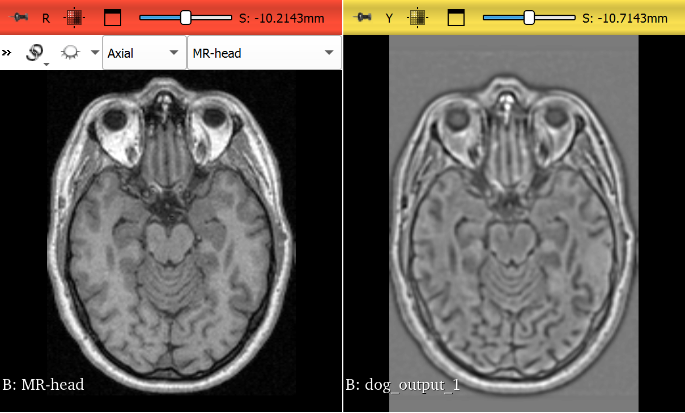

### My Observations

With sigma1 = 2.5 and sigma2 = 3.5 amount of smoothing in both images is similar and thus the difference produces a weak edge response. To observe finer details sigma2>>sigma1.
