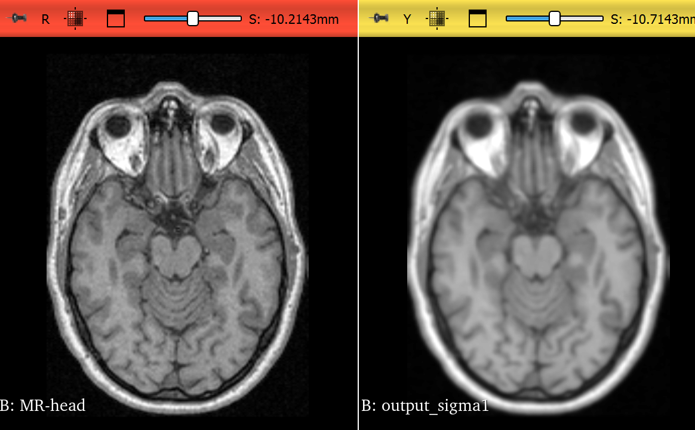

### My Observations

The image above uses a sigma of 1.0
After applying the filter it smooths the image by reducing high-frequency components such as noise and fine details.
Increasing the sigma increases the smoothing effect but also blurs out details in the original volume.
