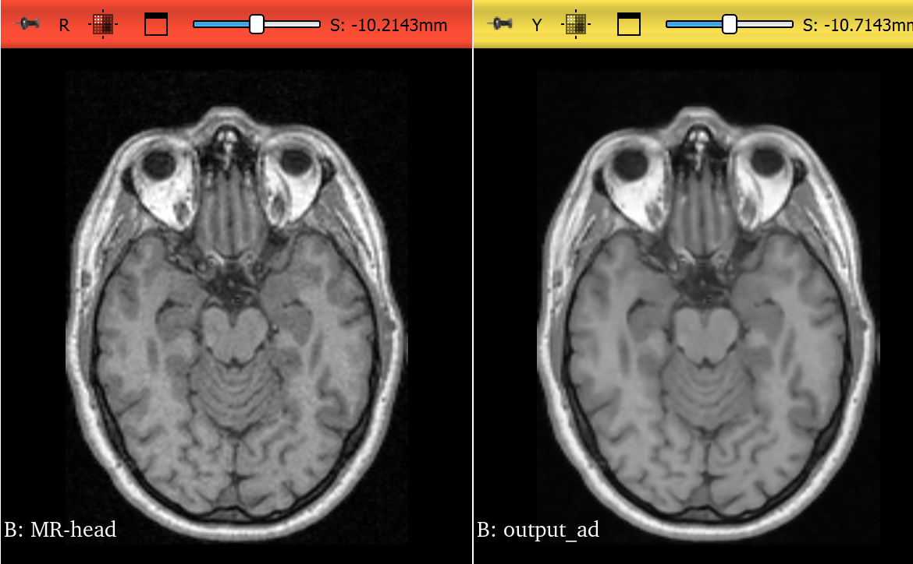

### My Observations

This image uses conductance:1.0, timestesp:0.05, iteration:5
Lowering the conductance to 1.0 reduces diffusion across edges, which helps preserve edge details. Additionally, reducing the number of iterations decreases the overall smoothing effect. As a result, the image retains sharper edges and finer structures, but less noise is removed.